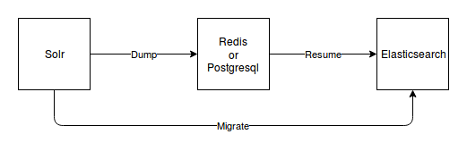
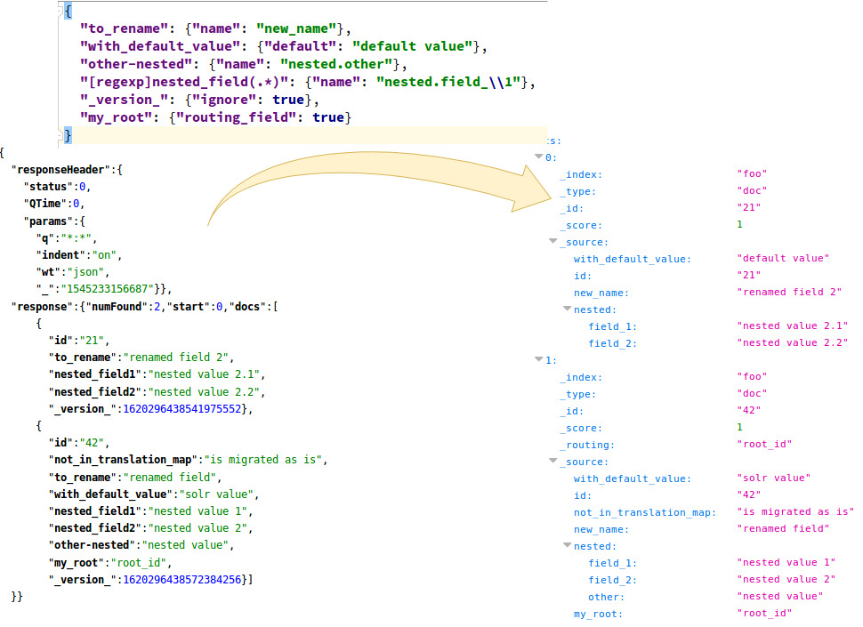

solr2es
=======

.. image:: https://circleci.com/gh/ICIJ/solr2es.png?style=shield&circle-token=846c844f540fb3746b80b8f12656ddde665b5037
   :alt: Circle CI
   :target: https://circleci.com/gh/ICIJ/solr2es

Migration script from solr to elasticsearch via a queue, that could be either redis or postgresql.

CLI
---

Here are the option to use as a command line :

* -m | --migrate : to migrate from a solr index to an elasticsearch index
* -r | --resume : to resume from a given queue to an elasticsearch index. By default, the queue will be redis. If the parameter "postgresqldsn" is set, the queue will be postgresql.
* -d | --dump : to dump from a solr index into a queue. By default, the queue will be redis.  If the parameter "postgresqldsn" is set, the queue will be postgresql.
* -t | --test : to test the solr and elasticsearch connections
* -a | --async : to use python 3 asyncio
* --solrhost : to set solr host (by default: 'solr')
* --solrfq: to set solr filter query (by default: '*')
* --solrid: to set solr id field name (by default: 'id')
* --core: to set solr core name (by default: 'solr2es')
* --index: to set index name for solr and elasticsearch (by default: solr core name, see --core parameter)
* --redishost: to set redis host (by default: 'redis')
* --postgresqldsn: to set postgresql Data Source Name (by default: None, by example: 'dbname=solr2es user=test password=test host=postgresql')
* --eshost: to set elasticsearch host (by default: 'elasticsearch')
* --translationmap: dict string or file path (starting with @) to translate fields from queue into elasticsearch (by default: None, by example: '{"postgresql_field": {"name": "es_field"}}')
* --esmapping: dict string or file path (starting with @) to set elasticsearch mapping (by default: None)
* --essetting: dict string or file path (starting with @) to set elasticsearch setting (by default: None)

Installation
------------
::

    sudo add-apt-repository ppa:deadsnakes/ppa
    sudo apt-get install python3.6 python3.6-dev libpq-dev
    virtualenv --python=python3.6 venv
    source venv/bin/activate
    pip install solr2es

Translation map
---------------

The purpose of a translation_map is to create a mapping between the fields coming from the queue (either Redis or Postgresql) to the ones inserted to Elasticsearch.

1. If a field from the queue doesn't exist in the translation_map, it will be inserted as it is into Elasticsearch.

2. Use the property *name* to rename a field in Elasticsearch :

::

    {"queue_name": {"name": "elasticsearch_name"}}

3. Use the property *default* if you want to set a default value into a field in Elasticsearch.

If the field exists into the queue and has a value, it won't be changed by the translation_map.
Otherwise a field *queue_name* willl be added to Elasticsearch with value *john doe*.

::

    {"queue_name": {"default": "john doe"}}

4. Use the property *name* with some *.* in it, to create a nested field in Elasticsearch.

If the queue record has a field *nested_a_b*, the Elasticsearch record will get a field *nested*, that will have a nested field *a*, that will have a nested field *b* that will get the content of *nested_a_b*.

::

    {"nested_a_b": {"name": "nested.a.b"}}

5. Use the property *name* with some regex groups capture to rename a bulk of queue fields in Elasticsearch by adding `[regexp]` at the beginning of the field.
This will rename all the fields prefixed by *queue_* into *elasticsearch_*.

::

    {"[regexp]queue_(.*)": {"name": "elasticsearch_\\1"}}

6. Use the property *ignore* at *true* to ignore some fields from the queue to Elasticsearch.

::

    {"ignored_field": {"ignore": true}}

7. Use the property *routing_field* set to *true* to use one field for routing in elasticsearch. An exception will be raised if several fields are set to true.

::

    {"my_root_doc": {"routing_field": true}}

8. Use the property *multivalued* set to *false* to ignore multi valued array field. Get the first value instead. By default the array is copied.

::

    {"my_array": {"multivalued": false}}

Execution
---------

1. Execute a dump from Solr into Postgresql specifying the Solr host, the Solr core, the Solr id and the Postgresql DSN

::

    solr2es --postgresqldsn 'dbname=solr2es user=test password=test host=localhost' --solrhost 127.0.0.1 --core test_core --solrid solr_id -d -a

2. Execute a resume from Postgresql into Elasticsearch specifying the Postgresql DSN, the Elasticsearch index, the Elasticsearch mapping, the Elasticsearch settings and the translation map

::

    solr2es --postgresqldsn 'dbname=solr2es user=test password=test host=localhost' --index es-index --translationmap @examples/translation-map.json --esmapping @examples/datashare_index_mappings.json --essetting @examples/datashare_index_settings.json -r -a

Test
----

To build and run tests you can make :

::

    virtualenv --python=python3.6 venv
    source venv/bin/activate
    python setup.py develop
    python setup.py test

To release :

::

    python setup.py sdist bdist_egg upload

Misc
----

Some features are not implemented yet :

- Resume from the redis queue to elasticsearch in asynchronous mode (function aioresume_from_redis)
- Resume from the redis queue to elasticsearch in synchronous mode (function resume_from_redis)
- Resume from the postgresql queue to elasticsearch in synchronous mode (function resume_from_postgresql)